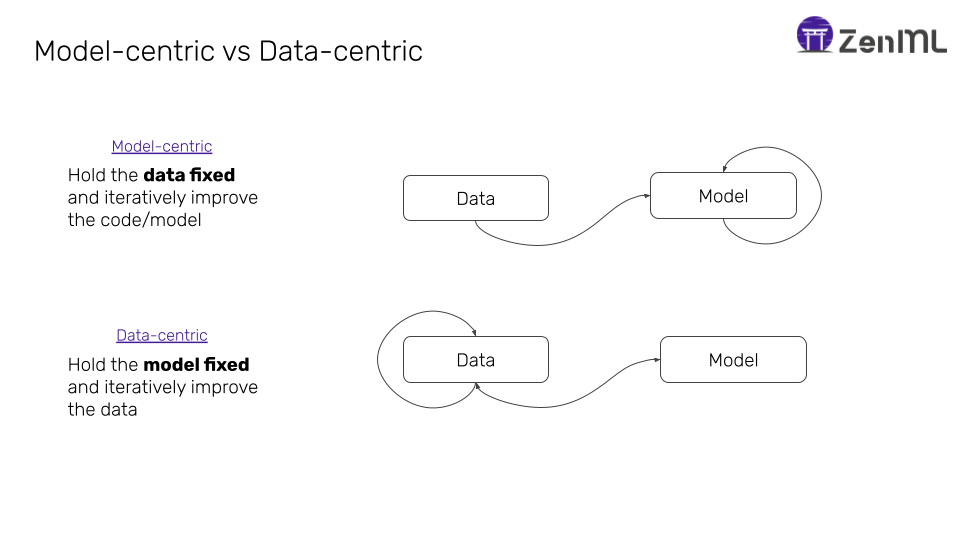
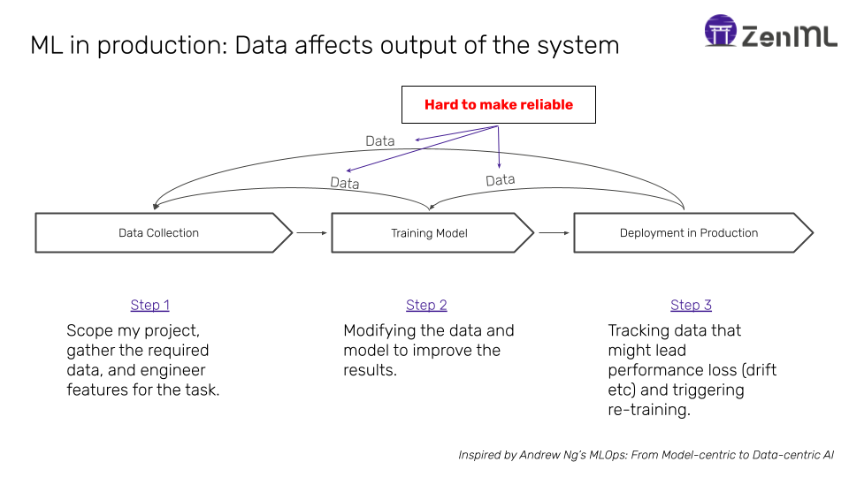

# A data-centric perspective on MLOps

To understand _data-centric MLOps_, we must first understand _data-centric machine learning_: Data-centric machine learning refers to an approach the focus is primarily on the quality, diversity, and reliability of the data used for training models. In traditional ML approaches, much emphasis is placed on selecting the right algorithms and optimizing their parameters. While this is still important in data-centric ML, equal or greater emphasis is placed on the data itself. In a picture

(Image taken from [here](https://www.zenml.io/blog/its-the-data-silly-how-data-centric-ai-is-driving-mlops))

Here's a breakdown of the key aspects of data-centric machine learning:

1. **Data Quality**: Ensuring that the data used for training ML models is accurate, relevant, and representative of the problem domain. This involves data cleaning, preprocessing, and validation to remove noise, errors, and inconsistencies.

2. **Data Diversity**: Incorporating a diverse range of data samples to train models effectively. This includes ensuring that the training dataset covers various scenarios, edge cases, and potential biases to build robust models that generalize well to unseen data.

3. **Data Augmentation**: Enhancing the diversity and quantity of training data through techniques such as data synthesis, transformation, and perturbation. Data augmentation helps prevent over-fitting and improves model performance by exposing it to a wider range of variations within the data.

4. **Data Labeling**: Ensuring accurate and reliable labeling of data, especially in supervised learning tasks. Labeling is a crucial step in training supervised models, and errors or inconsistencies in labels can significantly impact model performance. Techniques such as active learning and semi-supervised learning may be employed to optimize the labeling process.

5. **Data Versioning and Management**: Implementing robust systems for versioning and managing datasets throughout the ML lifecycle. This includes tracking changes to data, maintaining metadata, and ensuring reproducibility across experiments and model iterations.

6. **Data Bias and Fairness**: Identifying and mitigating biases present in the training data that could lead to unfair or discriminatory outcomes in ML models. This involves analyzing the data for biases related to factors such as demographics, geography, or socioeconomic status and applying techniques to address these biases.

7. **Data Privacy and Security**: Implementing measures to protect sensitive information in the data and ensure compliance with privacy regulations such as GDPR or HIPAA. This includes techniques such as data anonymization, encryption, and access control to safeguard data privacy and prevent unauthorized access.

... and the list could probably be extended.  Now, what is data-centric MLOps? A picture is worth a thousand words, they say, so here's the picture:

(Image taken from [here](https://www.zenml.io/blog/its-the-data-silly-how-data-centric-ai-is-driving-mlops))

MLOps is mostly about data flowing from one stage to another! How does this inform our MLOps practices?
First, we should probably be spending much more time on engineering our data pipelines (that's why we dedicated a whole lab to building them ;))!
Second, a lot of downstream issues have their causes in the data. This means also means that we can and should address most issues early on in the process!

Now that we have convinced you that MLOps is really mostly "DataOps", the next section will cover a foundation of any data-centric approach: Storing and versioning the data.
